  

 

---

## 👤 About Me

Hi, I'm **Vetrivel Maheswaran** — a Data Engineer and AI practitioner based in Dayton, NJ.

I build production-grade **data pipelines**, **LLM-powered agents**, and **RAG systems** that bridge reliable data infrastructure with intelligent automation. My work spans food-tech, fintech compliance, and academic AI research.

- 🎓 **MS in Information Technology & Analytics** — Rochester Institute of Technology (GPA: 4.0/4.0)
- 🛠️ Core stack: **API Developer · LLM Systems Integration · Data Engineer · RAG & Agentic Workflows · SQL & Database Engineering**
- 🔬 Research: LLM-based security policy generation @ Sungkyunkwan University, South Korea
- 💼 Experience: Data Engineering · AI Engineering · LLM Systems · Backend APIs
- 📍 Based in New Jersey | Open to **US Full-Time Roles**
- 📬 Reach me: [vetrim2003@gmail.com](mailto:vetrim2003@gmail.com) · [LinkedIn](https://linkedin.com/in/vetrivel-maheswaran) · [Portfolio](https://vetrivel-maheswaran.onrender.com)

---

## 🧭 What I Do

<table>
<tr>
<td width="50%" valign="top">

### 🗄️ Data Engineering
- End-to-end **ETL/ELT pipeline** design and maintenance
- **Relational & dimensional data modeling**
- SQL-driven workflows across MySQL, PostgreSQL, Oracle
- **Schema design**, query optimization, data quality
- Multi-source ingestion from Excel, CSV, APIs into structured databases

</td>
<td width="50%" valign="top">

### 🤖 AI & LLM Systems
- **RAG pipelines** with hybrid vector–graph retrieval
- **LLM agent** development with LangChain, MCP, tool calling
- Prompt engineering, context engineering, output validation
- **Agentic workflows** with FastAPI orchestration
- LLM integration for finance, compliance, and research domains

</td>
</tr>
</table>

---

## 🛠️ Tech Stack

**AI & LLM Systems**

**Data & ML Pipelines**

**Databases & Engineering**

**Programming & Systems**

**Backend & Tools**

---

## 📊 GitHub Stats

 

 

 

 

---

## 🤝 Connect With Me

&nbsp;
&nbsp;
&nbsp;
&nbsp;

 

---

<h2 align="center">📖 Guestbook</h2>

Recruiters, collaborators, or just passing by — drop a message!

 

---

 

    

<i>© Vetrivel Maheswaran</i>

